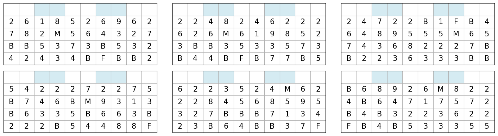

# Stratego Setup Generator

Stratego is a board game for two players, played on a board of 10×10 squares. 
Each player controls 40 pieces. The goal is to either capture your opponent's flag or all of their movable pieces.

An important part of the strategy in Stratego is the initial setup of the pieces. Each player decides where to place each of their 40 pieces on their 4×10 part of the board. 
Players tend to follow certain patterns in their setups. For example, the flag is usually placed on the last row surrounded by bombs.

In this repository we use deep learning to generate human-like Stratego setups. We train our models using setups from the gravon.de archive of Stratego games.

## Stratego Pieces

| Symbol | Piece Type  | Count |
|:------:|:-----------:|:-----:|
| 1      | Spy         | 1×    |
| 2      | Scout       | 8×    |
| 3      | Miner       | 5×    |
| 4      | Sergeant    | 4×    |
| 5      | Lieutenant  | 4×    |
| 6      | Captain     | 4×    |
| 7      | Major       | 3×    |
| 8      | Colonel     | 2×    |
| 9      | General     | 1×    |
| 10     | Marshal     | 1×    |
| B      | Bomb        | 6×    |
| F      | Flag        | 1×    |


## Features

- LSTM-based autoregressive setup generator
- Transformer-based autoregressive setup generator
- Evaluation notebooks with techniques like adversarial validation (how easily a classifier can tell if a setup is real or generated) and memorization checks (finding the most similar real setup for each generated setup)
- Notebook with statistical analysis of piece placement patterns from the training data (gravon.de archive setups), found in `notebooks/gravon_setups_analysis.ipynb`


## Project Structure

- `src/` - Source code  
- `data/` - Training data  
- `models/` - Trained model checkpoints  
- `notebooks/` - Notebooks for model training, evaluation and various experiments


##  Installation

```bash
git clone https://github.com/angelosmar1/stratego-setup-generator
cd stratego-setup-generator
pip install -e .
```
For GPU support (optional but recommended) install a CUDA-enabled version of PyTorch before installing the project.


## Example

```python
import torch
from stratego_setup_generator.generators import LSTMGenerator
from stratego_setup_generator.plotting import plot_setups

MODEL_PATH = "models/lstm_generator.pth"

device = torch.device("cuda" if torch.cuda.is_available() else "cpu")
checkpoint = torch.load(MODEL_PATH, map_location=device)

model = LSTMGenerator(**checkpoint["model_params"])
model.load_state_dict(checkpoint["model_state_dict"])
model = model.to(device)

sample_setups, _ = model.generate_setups(num_setups=4, seed=42)
plot_setups(sample_setups, num_columns=2)
```


