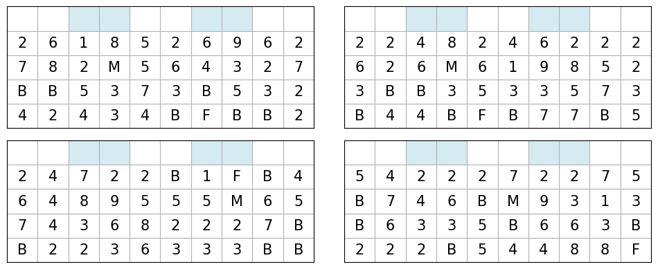

# Stratego Setup Generator

Stratego is a board game for two players, played on a board of 10x10 squares. 
Each player controls 40 pieces. The goal is to either capture your opponent's flag or all of their movable pieces.

An important part of the strategy in Stratego is the initial setup of the pieces. Each player decides where to place each of their 40 pieces on their 4x10 part of the board. 
Players tend to follow certain patterns in their setups. For example, the flag is usually placed on the last row surrounded by bombs.

In this repository we use deep learning to generate human-like Stratego setups. We train our models using setups from the gravon.de archive of Stratego games.

## Stratego Pieces

| Symbol | Piece Type  | Count |
|:------:|:-----------:|:-----:|
| 1      | Spy         | 1x    |
| 2      | Scout       | 8x    |
| 3      | Miner       | 5x    |
| 4      | Sergeant    | 4x    |
| 5      | Lieutenant  | 4x    |
| 6      | Captain     | 4x    |
| 7      | Major       | 3x    |
| 8      | Colonel     | 2x    |
| 9      | General     | 1x    |
| 10     | Marshal     | 1x    |
| B      | Bomb        | 6x    |
| F      | Flag        | 1x    |

## Example

```python
import torch
from src.generators import LSTMGenerator
from src.plotting import plot_setups

MODEL_PATH = "models/lstm_generator.pth"

device = torch.device("cuda" if torch.cuda.is_available() else "cpu")
loaded_model_info = torch.load(MODEL_PATH, map_location=device)
model = LSTMGenerator(**loaded_model_info['model_params'])
model.load_state_dict(loaded_model_info['model_state_dict'])
model = model.to(device)

sample_setups, _ = model.generate_setups(num_setups=6, seed=42)
plot_setups(sample_setups)
```


